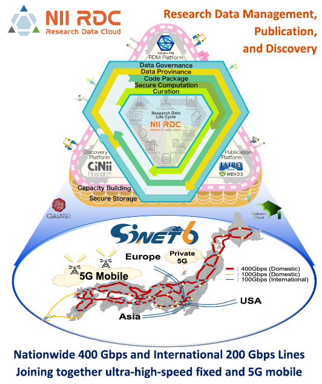
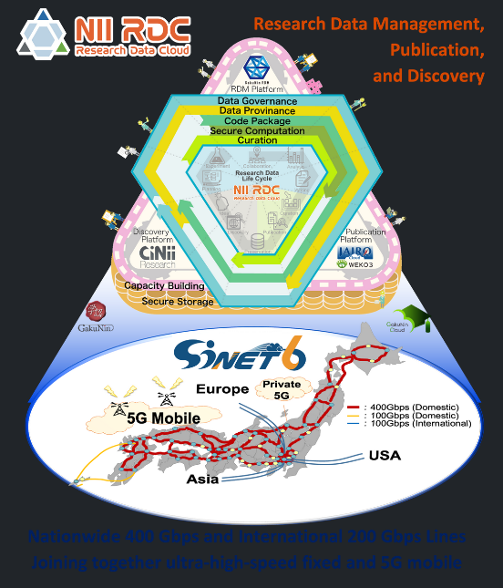

## 環境構築
- 以下は VSCode + remote container を使った方法
  - Ctrl-P → `>` を入力 → `Dev Containers: Open Folder in Container...` でこのリポジトリを選択
  - ひたすら待つ
    - postCreateCommand で `bundle install` まで自動でやってくれます
    - 画面下のターミナルに `Done. Press any key to close the terminal.` が表示されたら完了です

## 動作確認
- Ctrl-P → `>` を入力 → `Tasks: Run Test Task` を選択
- 画面右下に `ポート 4000 で実行されているアプリケーションは使用可能です。` というダイアログが出るので、ダイアログ中の `ブラウザで開く` をクリックすればブラウザ上で確認できます。
  - `エディターでのプレビュー` をクリックすればエディタ内で確認できます。
  - ブラウザから http://localhost:4000/ を直接開いて確認することもできます。

## `Gemfile` を更新した場合
ターミナルから `bundle update` を実行し、`Gemfile.lock` および各 gem を更新する必要があります。

## ヘッダーのナビゲーションを更新したい

- リポジトリの `_data/navigation.yml` を変更することで更新できます。

## サイト用画像を作成する注意点

現在サイト生成時に、閲覧環境の OS の設定に応じてライトテーマ・ダークテーマが自動で切り替わる [monophase](https://github.com/zivhub/monophase) テーマを適用しています。

そのため、背景を透過した画像に黒や紺などの濃い色を文字色として使用すると、ダークテーマでは非常に見づらい図になる場合があります。
これは例えば PPT から直接 PNG としてファイルを書き出した場合などに起きるため、注意が必要です。

- 透過画像のライトテーマでの表示例
  
  

- 上の画像のダークテーマでの表示例。図下部の文字が見づらいことがわかると思います。

  

表示に問題がある場合、例えば以下の手順を用いて背景を透過しない画像を作成してください。
- PPT から一旦 PDF としてエクスポートする (必要な部分を選択して `図として保存` でも可)
  - PDF としてエクスポートした時点で背景非透過になります
- PDF を PNG にエクスポート
  - mac の場合はプレビューを使えば大丈夫です。PNG へのエクスポート時に `解像度 300 pixel/inch` の設定にしておくと画質的にも安心です
  - Windows での PDF -> PNG 変換の方法募集中

## `/projects` のリダイレクト先を変更したい

[NII の公式サイト](https://www.nii.ac.jp/research/centers/ccrd/) から https://ccrd.nii.ac.jp/projects/ にリンクが貼られています。
現在は https://ccrd.nii.ac.jp/projects/ は https://ccrd.nii.ac.jp/sc22/ へのリダイレクトになっています。

`/projects/index.md` の `redirect_to` の部分を修正することで、リダイレクト先を変更できます。
