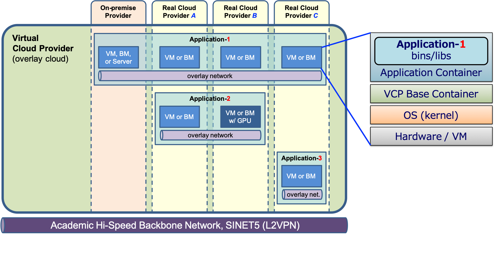

* toc
{:toc}

# Application-Centric Overlay Cloud Utilizing Inter-Cloud

Optimized and dedicated data analysis platforms are needed to fulfill the diverse requirements of big data applications. However, building an optimized platform is not easy. We propose the application-centric overlay cloud, which is an infrastructure to automatically build data analysis platforms customized for applications over multiple clouds.

## Research Goal
- Develop new infrastructure technology to automatically build data analysis platforms that are optimized for applications. We call this infrastructure the *application-centric overlay cloud*.
- Build an inter-cloud testbed configured by production-ready computing and networking resources.
- Apply the overlay cloud technology to genome sequencing (distributed data processing) and fluid acoustic analysis (coupled simulation).

NII group developed the following middleware.

---

## Virtual Cloud Provider (VCP)

VCP is a middleware to build an application environment over multiple cloud providers and the Japanese academic backbone network SINET5. VCP uses overlay cloud and overlay network architectures to treats multiple real clouds ('On-Premise provider and Real Cloud provider A-C' in the figure below) as a single virtual cloud ('Virtual Cloud Provider').

-	VCP supports from a simple application environment on a single cloud provider (Application-3), to a complex application environment using multiple cloud providers (Application 1 and 2).
-	VCP leverages Docker containers for quick application deployment and application environment reproducibility (right hand figure shows the a compute instance architecture).
-	VCP supports both common and GPU-enabled instances. (blue boxes)
-	VCP supports the following cloud providers;
    -	Public Cloud: Amazon Web Services, Microsoft Azure, Oracle Cloud Infrastructure, Sakura Cloud
    -	Academic Cloud: Hokkaido-Univ. Server Service
    -	On-premise: VMware

VCP is a core software of NII's GakuNin Cloud On-demand Configuration Service.

-	A Python-based development kit called VCP SDK and a monitoring tool are provided.
-	Jupyter Notebook-based templates for typical academic applications, such as moodle, Galaxy, and OpenHPC, are provided.

## Dynamic Reconfiguration Framework
We propose a framework that adds and removes computing resources (BM or VM) during runtime. The main idea is that we can represent requirements of computing resources to be reconfigured as constraints on specifications of computing resources.

It consists of two subsystems:
- The *application scheduler* monitors the application state and sends the constraints for new computing resources (e.g., #CPU cores, memory size, and location of resources to handle privacy-sensitive data) to the resource allocator.
- The *resource allocator* finds the resources that satisfy the constraints from the application scheduler and allocate them by using VCP.

We have developed a prototype for genome analysis workflows as described below.

## An Ecosystem to Utilize Execution Records of Genome Analyses Workflows
Collecting workflow execution records such as execution time for each step is important for selecting appropriate computing resources. We have developed an ecosystem to collect and utilize workflow execution records including our reconfiguarion prototype.

- We developed a prototype of our reconfiguration system based on Galaxy as described above. It collects and utilizes workflow metrics and container metrics.
- We also developed DrillHawk, which is a visualizer of workflow metrics.
- Our reconfiguration system and DrillHawk utilize container metrics and workflow metrics obtained by CWL-metrics as well as the metrics obtained by our prototype.

### A Prototype for Genome Analysis Workflows
We developed a prototype based on [Galaxy](https://galaxyproject.org/) for genome analysis workflows. It consists of several modules: Galaxy, an application scheduler module (AS module in the figure), a resource allocator (RA in the figure), metrics server and VCP. Galaxy and an AS module behave as an application scheduler.

Our prototype introduces two types of virtual workflow step: `prepare job` and `reconf job` for dynamic reconfiguration:
- The `prepare job` step is invoked before executing a workflow and makes an allocation plan.
- The `reconf job` step is invoked before executing each step and allocates computing resources according to the allocation plan.

These virtual steps interact with an AS module to make a plan and to allocate computing resources. An *AS core* is a reconfiguration algorithm in the AS module and is designed as an external program to easily replace with other reconfiguration algorithm. We integrated our prototype with the reconfiguration algorithm by Hokkaido University group.

### Metrics Collection Scheme in our Prototype

Our prototype collects two types of metrics: *container metrics* and *workflow metrics*.

- Container metrics: Telegraf on the resource periodically collects container metrics such as CPU usage and memory usage.
- Workflow metrics: After finishing workflow execution, an application scheduler generates workflow metrics such as execution time for each step.

<!--  -->

We design the metrics format of workflow metrics to be compatible with workflow metrics obtained by [CWL-metrics](https://inutano.github.io/cwl-metrics/) by National Institute of Genetics group, which is a metrics collector for [Common Workflow Language (CWL)](https://www.commonwl.org/).

### DrillHawk: A Visualizer of Workflow Metrics

[DrillHawk](https://github.com/tom-tan/drill-hawk) enables us to take a drill-down approach in which we first check the list of collected workflow execution records, compare several execution records using workflow metrics, and analyze the specific execution records by using Kibana.

- It first shows collected workflow records in the metrics server.

- We can choose several workflow records and compare their execution times and monetary costs. In the figure, each bar represents an execution time for each workflow execution and each color represents a execution time for each step.

- We can investigate more details with Kibana from the above comparing graph.

## Links

- Publications:
    - VCP: [https://nii-gakunin-cloud.github.io/#vcp](https://nii-gakunin-cloud.github.io/#vcp)
    - Dynamic Reconfiguration Framework: [https://nii-gakunin-cloud.github.io/#applications](https://nii-gakunin-cloud.github.io/#applications)

## Acknowledgement
This work was supported by JST CREST Grant Number JPMJCR1501, Japan.
