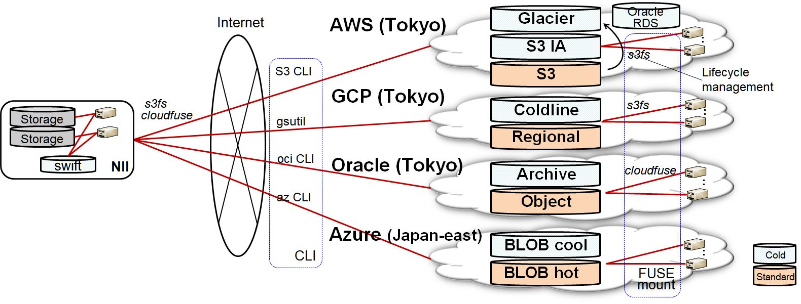
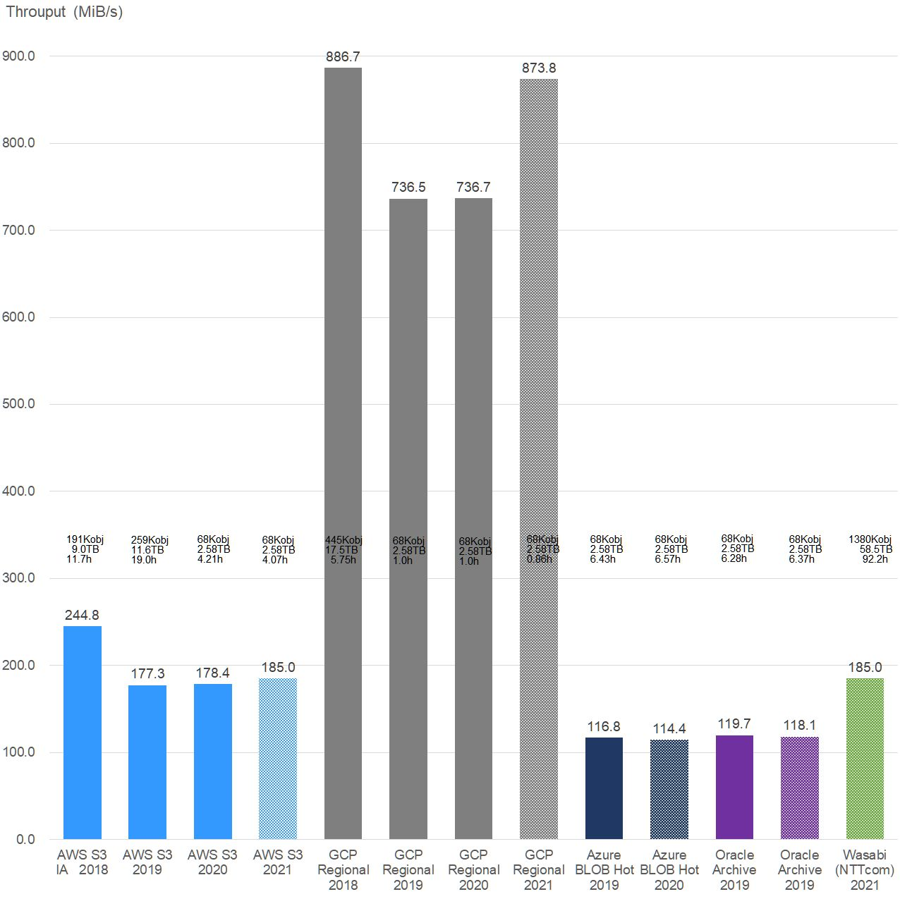
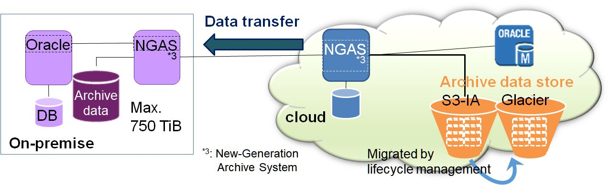
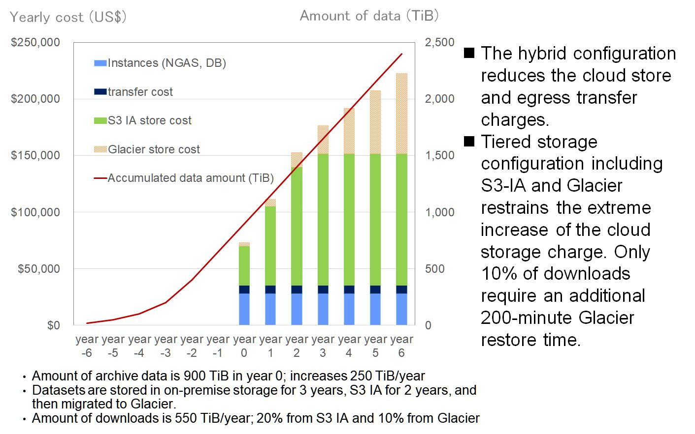

# Performance and Cost of Cloud Cold Storage for Astronomy Data Archive and Analysis
The adoption of cloud cold storage should be considered in order to reduce the TCO and the labor of storage management of maintaining large amounts of research data for long periods. Acquiring information on performance, manageability, and cost, and establishing best practices through PoC activities are crucial for adopting cloud cold storage.

## Research Goal
The goal is to acquire practical information for making decisions about storing research data in cloud cold storage and designing an overall data storage architecture by conducting experiments using the cold storage services of multiple commercial public clouds.
The PoC is focused on case study analyses of storing actual research data and accessing them through research applications.
  
High energy physics: Belle II experiment physical simulation data provided by KEK [1]  
  
Astronomy: Data of ALMA and Nobeyama Radio Observatory provided by NAOJ [2]  
  
For the astronomy data, we have also started an additional PoC where data analyses are also performed inside the cloud using server instances.
  
  
### PoC Configuration  
    
  
    
### Example of PoC Results  
  
### Performance of uploading astronomy data  
    

### Estimation of cloud charge in a hybrid configuration

### (1) Tiered storage including Glacier, S3 IA, and on-premise storage  
  

### (2) Estimation  
  
  
  
  
## Links
[Presentation] (English) 

Hiroshi Yoshida: "Experiments in Storing Scientific Research Data in Cloud Cold Storage Services", in presentations of Storage Developers Conference 2018.  
[https://www.snia.org/sites/default/files/SDC/2018/presentations/Cloud_Storage/Yoshida_Hiroshi_Experiments_in_Storing_Scientific_Research_Data_in_Cloud_Cold_Storage_Services.pdf
https://www.youtube.com/watch?v=hyc25lYdOJA](https://www.snia.org/sites/default/files/SDC/2018/presentations/Cloud_Storage/Yoshida_Hiroshi_Experiments_in_Storing_Scientific_Research_Data_in_Cloud_Cold_Storage_Services.pdf
https://www.youtube.com/watch?v=hyc25lYdOJA)

[Presentation] (Japanese) 

Hiroshi Yoshida, Kento Aida, et al.: "PoC of storing and analyzing the ALMA telescope observation data leveraging Public Cloud Services", in presentations of CloudWeek2020＠Hokkaido University.  
[https://www.youtube.com/watch?v=MhIVZzrNVwo&feature=emb_logo](https://www.youtube.com/watch?v=MhIVZzrNVwo&feature=emb_logo)

[Slides] 

   
   
   
  
   
   
### Acknowledgment
We would like to thank the PoC members of KEK and NAOJ for providing data and support.

[1] High Energy Accelerator Research Organization  
[2] National Astronomical Observatory of Japan  
[3] New Generation Archive System  
