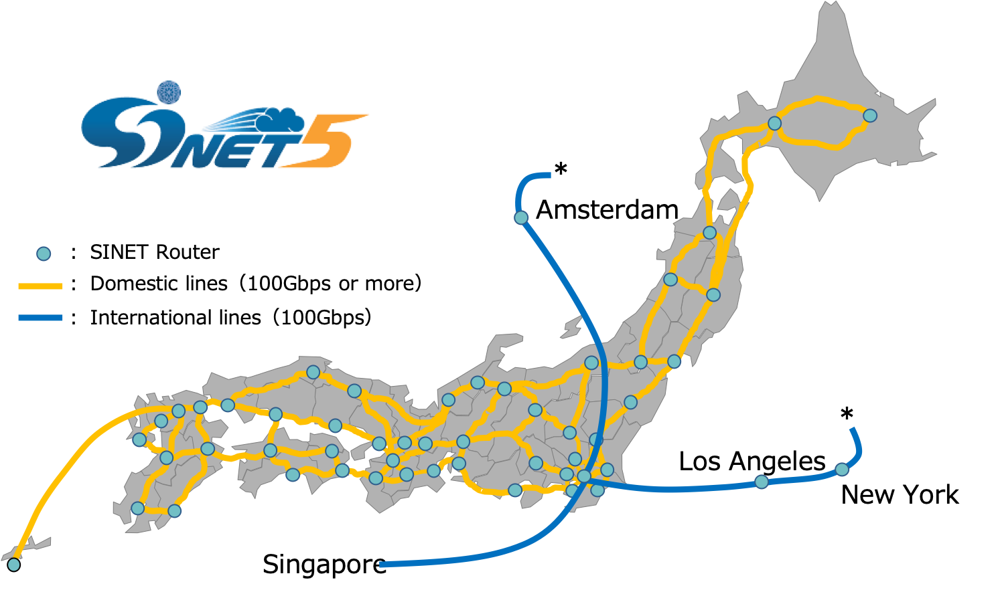
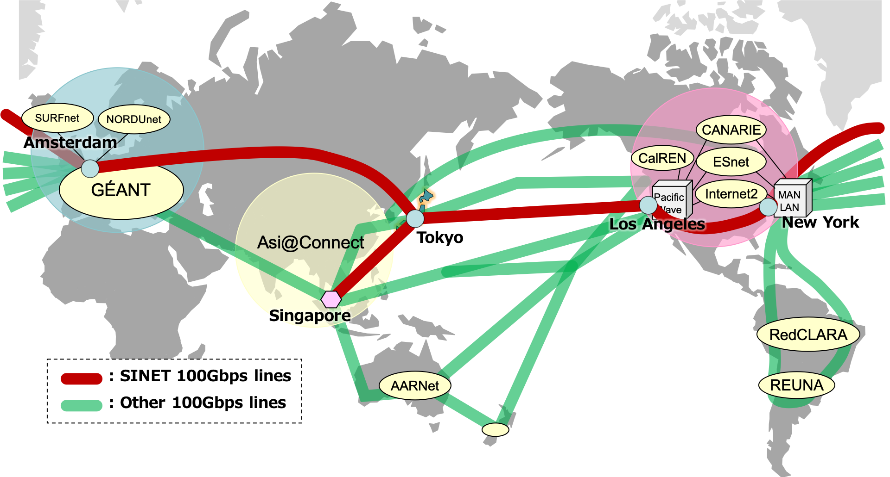

# Center for Cloud Research and Development, NII

The National Institute of Informatics (NII) seeks to advance integrated research and development activities in information-related fields, including networking, software, and content. NII also promotes the creation of a state-of-the-art academic information infrastructure, such as SINET, a Japanese high-performance R&E network. 

The center aims at establishment of the national advanced R&E infrastructure taking advantage of clouds. We research and develop advanced cloud infrastructure technologies enabling data-driven science, including inter-cloud, IoT, reproducible infrastructure, data storage, and authentication.

- Research and development of infrastructure technologies such as cloud architecture and middleware.
- Establishment of inter-cloud testbed in cooperation with researchers in universities.
- Research and development of inter-cloud application software in cooperation with researchers in universities.

This website exhibit presents the latest results of our projects aimed at building academic cloud infrastructure for data-driven science.

# Projects

## Application-Centric Overlay Cloud Utilizing Inter-Cloud ([link](CREST))
Optimized and dedicated data analysis platforms are needed to fulfill the diverse requirements of “big data” applications. However, building an optimized platform is not easy. To facilitate this, we developed Virtual Cloud Provider middleware to automatically build data analysis platforms customized for applications over multiple clouds. An ecosystem to utilize execution records of application workflows (e.g., Genome Sequencing) was also developed to optimize resource allocation for an application.

## IoT Stream Processing ([link](SINETStream))
The “big data” generated by numerous indoor and outdoor IoT devices must be securely analyzed in real-time to create various innovative services. SINET allows the construction of an end-to-end isolated HPC and IoT environment using a VPN over mobile and wired networks. SINETStream is a software library that enables the easy development of secure and efficient IoT applications over the environment.

## Reproducibility Extensions for Jupyter Notebook ([link](https://literate-computing.github.io/))
Jupyter Notebook has become an essential tool for computational research. Its computational narrative augments interactive exploration of data-driven science, then helps to present and share human-readable detailed computational steps. Our reproducibility extensions enhance semi-linear workflow controls to prevent miss-operation, give a perspective to complex operation structure, and secure throughout logs.

## PoC of Storing Scientific Research Data in Cloud Cold Storage ([link](Storage))
The adoption of cold storage services should be considered in order to reduce the TCO and the labor of storage management of maintaining large amounts of data for long periods. The goal of this project is to acquire practical information for making decisions about storing research data in cloud cold storage and designing an overall data storage architecture by conducting experiments using the cold storage services of multiple commercial public clouds.

## Cope with the Gap between Identity Federation and Cloud Service Sign-On
GakuNin is an identity access management (IAM) federation that universities and institutes in Japan join to make good use of academic e-resources. We fill the gap between the academic IAM framework (GakuNin) and authentication frameworks for public cloud services by extending the GakuNin Cloud Gateway Service (CGS), which enables efficient and suitable management by SAML identity providers (IdPs) and services providers (SPs) that permits end-users to easily access e-resources or services with a single sign-on (SSO).
