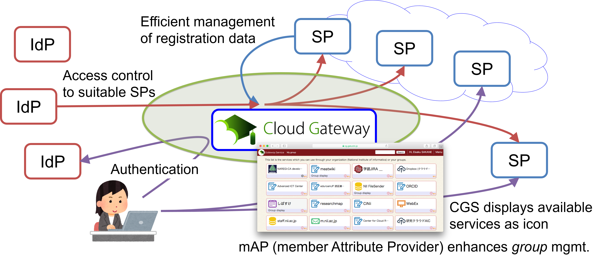
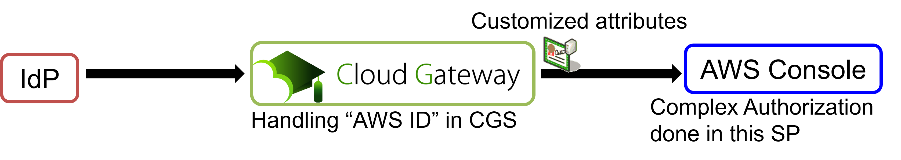

# GakuNin Cloud Gateway Service - Cope with the Gap between IAM Federation and Cloud Service Sign-On

Official Site:
GakuNin Cloud Gateway Service, [https://cloud.gakunin.jp/cgw/](https://cloud.gakunin.jp/cgw/) (in Japanese)

## GakuNin - Academic IAM Federation
GakuNin is an identity access management (IAM) federation that universities and institutes in Japan join to make good use of academic e-resources. The GakuNin Cloud Gateway Service (CGS) enables efficient and suitable management of information about SAML identity providers (IdPs) and services providers (SPs) and also enables end users to easily access e-resources or services with single sign-on (SSO).

<figure>
  

  
  
<figcaption>Fig.1. Architecture of GakuNin</figcaption>

  

</figure>

## Research Goal
The next step is to extend the SSO to cloud services that do not participate in the identity federation. Typical cloud services have the following characteristics that make them unpopular.

## The Typical Gap
1. Requires configuration for each individual service (complicated configuration).
2. Requires unfamiliar attributes.
3. Can only work with one IdP.
4. Authorizes by groups in a mechanism that is not based on attributes.
5. Has an unfamiliar user provisioning mechanism.
6. Has a concept of “tenant”.

Case 1: Dropbox
Applies: 1, 3, 4, 5, 6
Not applicable: 2

Case 2: Slack
Applies: 1, 3, 4, 6
Not applicable: 2, 5

Case 3: AWS Console
Applies: 1, 2, 6
Not applicable: 3, 4, 5

We extended our GakuNin CGS to fill this gap in case 3 as a proxy model:

<figure>
  

  
  
<figcaption>Fig.2. Proxy model for connecting AWS Console</figcaption>

  

</figure>

## Future issues
We are now aiming to create a more general-purpose proxy system based on the findings of these three cases.
