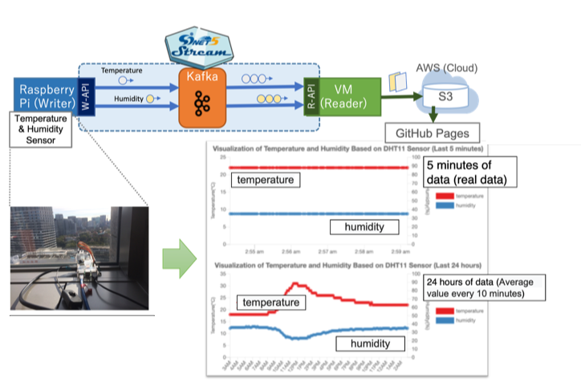

# IoT Stream Processing

<a href="https://www.youtube.com/watch?v=Z0wlUi4lr6c">Introduction of Wide Area Data Collection Infrastructure (Mobile SINET) and SINETStream</a>
 
<iframe width="560" height="315" src="https://www.youtube.com/embed/Z0wlUi4lr6c" frameborder="0" allow="accelerometer; autoplay; encrypted-media; gyroscope; picture-in-picture" allowfullscreen></iframe>

 
Official Site:
SINETStream, [https://www.sinetstream.net/](https://www.sinetstream.net/)

## Overview

The “big data” generated by numerous indoor and outdoor IoT devices must be securely analyzed in real time to create various innovative services. SINET allows the construction of an end-to-end isolated HPC and IoT environment using VPN over mobile and wired networks. SINETStream is a software library that enables the easy development of secure and efficient IoT applications over the environment.

## Mobile Network for IoT Applications by SINET
- The SINET Japanese R&E network enables each IoT application to construct an end-to-end isolated HPC and IoT environment using SINET VPN over mobile and wired networks (Fig.1).
- Each IoT application can construct an end-to-end isolated HPC and IoT environment using the SINET VPN.

<figure>
  

  
  
<figcaption>Fig.1. Overview of Mobile SINET.</figcaption>

  

</figure>

## SINETStream: Software Library for IoT Applications
- SINETStream (Fig.2) enables easy development of secure and efficient IoT applications, and supports Java, Python, and Android.

<figure>
  

  
  
<figcaption>Fig.2. SINETStream overview.</figcaption>

  

</figure>

- It provides the following capabilities:
    - User-friendly APIs to read/write stream data
    - Authentication and authorization
    - TLS and data encryption
    - Metrics collection
    - Cooperation with stream processing
    - Adaptation for various brokers such as MQTT and Apache Kafka.

<!--
<figure>
  

  
  
<figcaption>Fig.3. Relationship between SINETStream, message brokers and stream processing platforms.</figcaption>

  

</figure>
 -->
## Support for Android: SINETStream Android

- SINETStream Android consists of three libraries:
    - Core library
    	- provides the SINETStream basic functions.
    	- Enables to use MQTT brokers via Eclipse Paho ([https://www.eclipse.org/paho](https://www.eclipse.org/paho)).
    - Helper library
    	- Collects data from various sensors built-in an Android device.
    	- Publishes it via the core library.
    - Sample app
    	- Android app implemented using the helper library.
    	- allows users to collect sensors' data without development.

<!-- figure>
  

  
  
<figcaption>Fig.4. An example application using SINETStream for Android.</figcaption>

  

</figure -->

## SINETStream Use Cases

<!--
### Secure online video processing

- We employ YOLOv3 and OpenPose for object detection and human keypoint detection, respectively.
- Image stream data captured at the sensor are sent to the cloud via the VPN, stored and analyzed in real-time.
- IoT application servers including GPU nodes are easily deployed by using [VCP](https://ccrd.nii.ac.jp/sc20/CREST/#virtual-cloud-provider-vcp).

<figure>
  

  
  
<figcaption>Fig.5. Secure online video processing.</figcaption>

  

</figure>
-->

### Smart Ship (Tokyo University of Marine Science and Technology)
<figure>
  

  
  
<figcaption>Fig.3. Sensor data collection from a ship using SINETStream.</figcaption>

  

</figure>
 
<figure>
  

  
  
<figcaption>Fig.4. Route of Shioji Maru, a training ship of Tokyo University of Marine Science and Technology, by GPS sensor data. This map was created by processing the tiled map data provided by the Geospatial Information Authority of Japan. </figcaption>

  

</figure>

### Animal Telemedicine (Tokushima University)
<figure>
  

  
  
<figcaption>Fig.5. Sensor data collection from a trailer animal lab using SINETStream.</figcaption>

  

</figure>
 
<figure>
  

  
  
<figcaption>Fig.6. Example graph of sensor data. </figcaption>

  

</figure>

<!--
### Collection of Sensor Data from Android Smartphones
-->

<!--
- We develop an android app for various sensors' data collection, respectively (Fig.6).
- Data acquired by sensors equipped with SINET SIM for SINET connection can be collected and analyzed safely using a computer such as cloud connected with SINET VPN.
- Android device sensor data are accumulated in Elasticsearch via Mosquitto and Kafka, and the visualization results of different sensors can be analyzed by Kibana v7.0 for endpoint users.
-->
<!--
- SINETStream also provides an Android app that collects various sensor data from smartphones.
- The app can be utilized as a sensor program for IoT apps without coding.
- Selected sensor data captured by the app are sent to the cloud via the VPN, where they are stored and visualized in real-time.

<figure>
  

  
  
<figcaption>Fig.6. Android sensor data collection.</figcaption>

  

</figure>
-->

### Environment monitoring live demo

- With SINETStream you can easily develop a program that collect and analyze data from sensors distributed over a wide area network.
- The writer program running on a Raspberry Pi with temperature and humidity sensors continuously sends data to a messaging server called “SINETStream server” on AWS. 
- The reader program on AWS then receives the data from the SINETStream server and the processed data are periodically visualized [here](https://www.sinetstream.net/docs/livedemo/livedemo.en.html). 
- These programs use the SINETStream API to implement such functions as writing data from the sensor devices to the SINETStream server, and reading data from the server for visualization.

<figure>
  

  
  
<figcaption>Fig.7. Android sensor data collection.</figcaption>

  

</figure>

## Related Links
SINETStream Web site: [https://www.sinetstream.net/index.en.html](https://www.sinetstream.net/index.en.html) 
Live demo: [https://www.sinetstream.net/docs/livedemo/livedemo.en.html](https://www.sinetstream.net/docs/livedemo/livedemo.en.html) 
Tutorial: [https://www.sinetstream.net/docs/tutorial/index.en.html](https://www.sinetstream.net/docs/tutorial/index.en.html) 
Promotion video: [https://www.youtube.com/watch?v=Z0wlUi4lr6c](https://www.youtube.com/watch?v=Z0wlUi4lr6c) 

