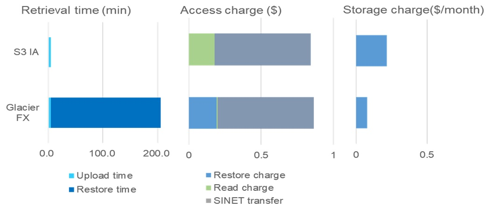

# Performance and Cost of Cloud Cold Storage for Astronomy Data Archive and Analysis
The adoption of cloud cold storage should be considered as a way to reduce the total cost of ownership (TCO) and the labor required for storing, managing, and maintaining large amounts of research data for long periods. Acquiring information on performance, manageability, and cost while establishing best practices through case studies are crucial for eventually reaching the point of adopting cloud cold storage.

## Purpose of Case Studies
The purpose of the studies is to acquire practical information for making decisions about storing research data in cloud cold storage and designing an overall data storage architecture by conducting experiments using the cold storage services of major commercial public clouds. 
In the studies, actual research data are stored in cloud storage services and accessed through research applications.
  
Astronomy: Data of ALMA and Nobeyama Radio Observatory provided by NAOJ [1]  
  
High energy physics: Belle II experiment physical simulation data provided by KEK [2]  
  
With the ALMA data, we also conduct data analyses performed in the cloud using VM  instances and investigate the optimization of hybrid configurations, including on-premise and cloud resources.
  
  
### Experiment configuration and measurement examples  
    
  
    
## Case Study Example: Estimation of cloud charge in a hybrid configuration

Cold storage services such as Glacier Flexible Retrieve require a long restoration time (multiple hours) before data retrieval; nevertheless they are advantageous in terms of storage cost.
  
### Results of the measurement using actual ALMA telescope data (16MB)  
    

Because NAOJ already possesses on-premise resources, a hybrid configuration based on a tiered storage architecture is a viable option that reduces cloud storage and egress transfer charges without crucial performance degradation.

### Tiered storage including Glacier, S3 IA, and on-premise storage  
  

The estimation proves that the tiered storage configuration including S3-IA and Glacier Flexible Retrieve restrains the extreme increase of the cloud storage charge. 

### (2) Cost Estimation  
  
  
  
  
## Links
[Presentation] (English) 
Hiroshi Yoshida: "Experiments in Storing Scientific Research Data in Cloud Cold Storage Services", in presentations of Storage Developers Conference 2018.  
[https://www.snia.org/sites/default/files/SDC/2018/presentations/Cloud_Storage/Yoshida_Hiroshi_Experiments_in_Storing_Scientific_Research_Data_in_Cloud_Cold_Storage_Services.pdf
https://www.youtube.com/watch?v=hyc25lYdOJA](https://www.snia.org/sites/default/files/SDC/2018/presentations/Cloud_Storage/Yoshida_Hiroshi_Experiments_in_Storing_Scientific_Research_Data_in_Cloud_Cold_Storage_Services.pdf
https://www.youtube.com/watch?v=hyc25lYdOJA)

[Presentation] (Japanese) 
Hiroshi Yoshida, Kento Aida, et al.: "PoC of storing and analyzing the ALMA telescope observation data leveraging Public Cloud Services", in presentations of CloudWeek2020＠Hokkaido University.  
[https://www.youtube.com/watch?v=MhIVZzrNVwo&feature=emb_logo](https://www.youtube.com/watch?v=MhIVZzrNVwo&feature=emb_logo)

[Slides]    
[Performance and Cost Evaluation of Public Cloud Cold Storage Services for Astronomy Data Archive and Analysis](https://ccrd.nii.ac.jp/sc21/Storage/material/SC21_Performance_and_Cost_of_Cloud_Cold_Storage_for_Astronomy_Data_Archive_and_Analysis.pdf)
   
   
   
  
   
   
### Acknowledgment
We would like to thank the PoC members of KEK and NAOJ for providing data and support.

[1] National Astronomical Observatory of Japan  
[2] High Energy Accelerator Research Organization  
[3] New Generation Archive System  
