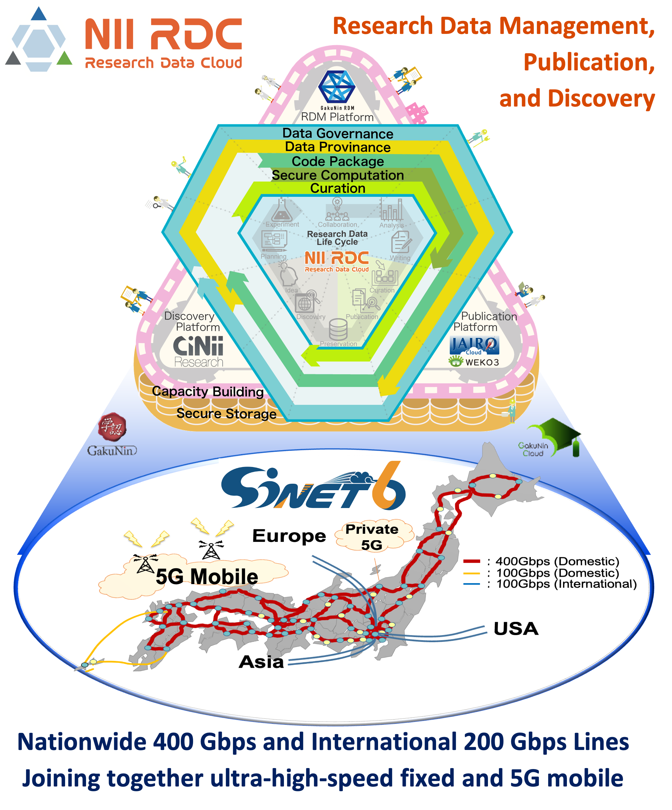

# Academic Information Infrastructure for Data-Driven Science

The National Institute of Informatics (NII) seeks to advance integrated research and development activities in information-related fields, including networking, software, and content. NII also promotes the creation of state-of-the-art academic information infrastructure, which is designed by fusing the new ultra high-speed network, SINET6, and the research data platform, NII Research Data Cloud, to promote data-driven science. 

This website exhibit presents the latest results of our projects aimed at building cloud and IoT platforms for high-performance and secure data-driven science.

# Projects

## Literate Computing for Reproducible Infrastructure ([link](https://literate-computing.github.io/fastpages/tools_en/))
- Jupyter Notebook extensions for reproducibility
- Knowledge sharing for IT operations utilizing Jupyter Notebook

## Automatically Building Systems for Dedicated Data Analysis ([link](CREST))
- Development of virtual cloud provider (VCP) for automatically building data analysis platforms
- Ecosystem for genome analysis workflows 

## IoT Stream Processing ([link](SINETStream))
- Development of SINETStream, a software library that enables easy development of secure and efficient IoT applications over the Internet

## Zero Trust based IoT Security ([link](https://zt-iot.nii.ac.jp/en/))
- Secure Internet of Things (IoT) systems in accordance with the concept of zero trust security by the fusion of formal verification and system software technologies

## Case Studies of Storing Scientific Research Data in Cloud Cold Storage Services ([link](Storage))
- Case studies of storing scientific research data, e.g., ALMA Radio Telescope data, and accessing them through research applications

## Cope with the Gap between Identity Federation and Cloud Service Sign-On ([link](CGW))
GakuNin is an identity access management (IAM) federation that universities and institutes in Japan join to make good use of academic e-resources. We fill the gap between the academic IAM framework (GakuNin) and authentication frameworks for public cloud services by extending the GakuNin Cloud Gateway Service (CGS), which enables efficient and suitable management by SAML identity providers (IdPs) and services providers (SPs) that permits end-users to easily access e-resources or services with a single sign-on (SSO).
