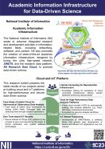
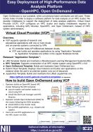
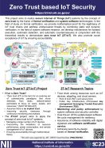
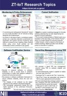
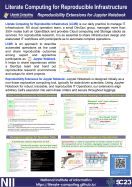
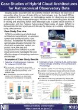

# Academic Information Infrastructure for Data-Driven Science

|Academic Information Infrastructure for Data-Driven Science||
|---|---|
[Overview](https://ccrd.nii.ac.jp/sc23/Overview/1_Overview.htm)||
[Easy Deployment of High-Performance Data Analysis Platform  - OpenHPC, Open OnDemand -](https://ccrd.nii.ac.jp/sc23/VCP/2_vcp.htm)||
[Extensible Scientific Workflow Engine and Ecosystem for Genome Analysis Workflows](https://ccrd.nii.ac.jp/sc23/EP3/3_ep3.htm)||
[IoT Stream Processing](https://ccrd.nii.ac.jp/sc23/SINETStream/4_SINETStream.htm)||
[Zero Trust based IoT Security Overview](https://ccrd.nii.ac.jp/sc23/ZTIoT1/5_ZTIoT1.htm)||
[ZT-IoT Research Topics](https://ccrd.nii.ac.jp/sc23/ZTIoT2/6_ZTIoT2.htm)||
[Literate Computing for Reproducible Infrastructure](https://ccrd.nii.ac.jp/sc23/Literate/7_Literate.htm)||
[Case Studies of Hybrid Cloud Architectures for Astronomical Observatory Data](https://ccrd.nii.ac.jp/sc23/NAOJ/8_PoC.htm)||
