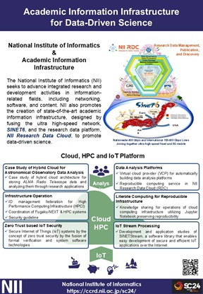
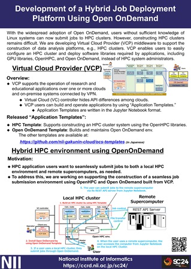

# Academic Information Infrastructure for Data-Driven Science

The National Institute of Informatics (NII) seeks to advance integrated research and development activities in informationrelated fields, including networking, software, and content. NII also promotes the creation of state-of-the-art academic information infrastructure, designed by fusing the ultra high-speed network, SINET6, and the research data platform, NII Research Data Cloud, to promote data-driven science.

[Download pdf](docs/1_Overview_A4.pdf)

# Development of a Hybrid Job Deployment Platform Using Open OnDemand

With the widespread adoption of Open OnDemand, users without sufficient knowledge of Linux systems can now submit jobs to HPC clusters. However, constructing HPC clusters remains difficult. We are developing Virtual Cloud Provider (VCP) middleware to support the construction of data analysis platforms, e.g., HPC clusters. VCP enables users to easily configure an HPC cluster and deploy software libraries required by applications, including GPU libraries, OpenHPC, and Open OnDemand, instead of HPC system administrators.

[Download pdf](docs/2_VCP_A4.pdf)
