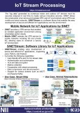
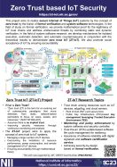
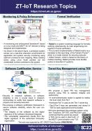
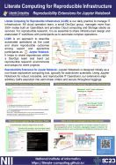
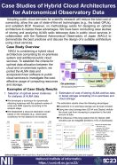

# Academic Information Infrastructure for Data-Driven Science

|   |   |   |
|---|---|---|
[Overview](https://ccrd.nii.ac.jp/sc24/1_Overview/1_Overview.htm)||[Download PDF](https://ccrd.nii.ac.jp/sc24/1_Overview/1_Overview_A4.pdf)|
[Development of a Hybrid Job Deployment Platform Using Open OnDemand](https://ccrd.nii.ac.jp/sc24/2_VCP/2_VCP.htm)||[Download PDF](https://ccrd.nii.ac.jp/sc24/2_VCP/2_VCP_A4.pdf)|
[Extensible Scientific Workflow Engine and Ecosystem for Genome Analysis Workflows](https://ccrd.nii.ac.jp/sc23/EP3/3_ep3.htm)||[Download PDF](https://ccrd.nii.ac.jp/sc23/EP3/3_SC23_ep3-a4.pdf)|
[IoT Stream Processing](https://ccrd.nii.ac.jp/sc23/SINETStream/4_SINETStream.htm) Project website - [sinetstream.net](https://www.sinetstream.net/index.en.html)||[Download PDF](https://ccrd.nii.ac.jp/sc23/SINETStream/4_SC23_SINETStream-A4.pdf)|
[Zero Trust based IoT Security Overview](https://ccrd.nii.ac.jp/sc23/ZTIoT1/5_ZTIoT1.htm) Project website - [zt-iot.nii.ac.jp](https://zt-iot.nii.ac.jp/)||[Download PDF](https://ccrd.nii.ac.jp/sc23/ZTIoT1/5_SC23_panel_zt-iot_overview_0929.pdf)|
[ZT-IoT Research Topics](https://ccrd.nii.ac.jp/sc23/ZTIoT2/6_ZTIoT2.htm)||[Download PDF](https://ccrd.nii.ac.jp/sc23/ZTIoT2/6_SC23_panel_zt-iot_topics_0906.pdf)|
[Literate Computing for Reproducible Infrastructure](https://ccrd.nii.ac.jp/sc23/Literate/7_Literate.htm)||[Download PDF](https://ccrd.nii.ac.jp/sc23/Literate/7_SC23_Literate Computing-v1.1 A4.pdf)|
[Case Studies of Hybrid Cloud Architectures for Astronomical Observatory Data](https://ccrd.nii.ac.jp/sc23/NAOJ/8_PoC.htm)||[Download PDF](https://ccrd.nii.ac.jp/sc23/NAOJ/8_Case Studies of the Hybrid Cloud Architecture for Astronomical Observatory Data_A4_20230925.pdf)|
