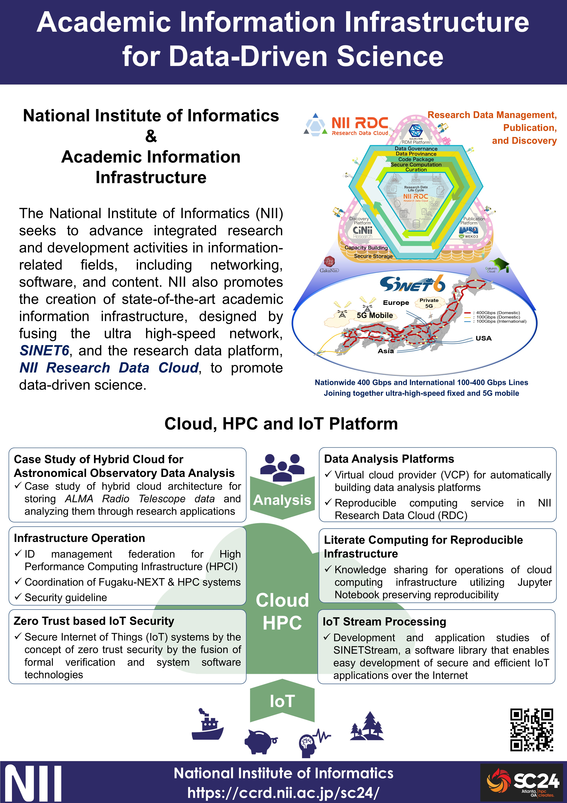
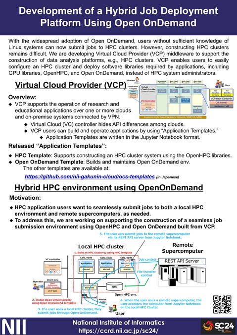

# Academic Information Infrastructure for Data-Driven Science

|   |   |   |
|---|---|---|
[Overview](https://ccrd.nii.ac.jp/sc24/1_Overview/1_Overview.htm)||[Download PDF](https://ccrd.nii.ac.jp/sc24/1_Overview/1_Overview_A4.pdf)|
[Development of a Hybrid Job Deployment Platform Using Open OnDemand](https://ccrd.nii.ac.jp/sc24/2_VCP/2_VCP.htm)||[Download PDF](https://ccrd.nii.ac.jp/sc24/2_VCP/2_VCP_A4.pdf)|
[IoT Stream Processing](https://ccrd.nii.ac.jp/sc24/3_SINETStream/3_SINETStream.htm) Project website - [sinetstream.net](https://www.sinetstream.net/index.en.html)||[Download PDF](https://ccrd.nii.ac.jp/sc24/3_SINETStream/3_SC24_SINETStream-A4.pdf)|
[Zero Trust based IoT Security(https://ccrd.nii.ac.jp/sc24/4_ZTIoT/4_ZTIoT.htm) Project website - [zt-iot.nii.ac.jp](https://zt-iot.nii.ac.jp/)||[Download PDF](https://ccrd.nii.ac.jp/sc24/ZTIoT/4_SC24_panel_zt-iot_overview_0929.pdf)|
[Operation Technologies for Next-Generation HPC Infrastructure](https://ccrd.nii.ac.jp/sc24/5_NGFS/2_NGFS.htm)||[Download PDF](https://ccrd.nii.ac.jp/sc24/5_NGFS/5_NGFS_A4.pdf)|
[Practice of Efficient Identity Proofing in HPCI Sign-up with Federated Credentials](https://ccrd.nii.ac.jp/sc24/6_HPCI/6_HPCI.htm)||[Download PDF](https://ccrd.nii.ac.jp/sc24/6_HPCI/6_HPCI_A4.pdf)|
[Case Studies of Hybrid Cloud Architectures for Astronomical Observatory Data](https://ccrd.nii.ac.jp/sc24/7_NAOJ/8_PoC.htm)||[Download PDF](https://ccrd.nii.ac.jp/sc24/7_NAOJ/8_Case Studies of the Hybrid Cloud Architecture for Astronomical Observatory Data_A4_20230925.pdf)|
[Research Data Analysis Platform for Reproducible Data-driven Science](https://ccrd.nii.ac.jp/sc24/8_FCS/8_FCS.htm)||[Download PDF](https://ccrd.nii.ac.jp/sc24/8_FCS/8_FCS_A4.pdf)|
[Literate Computing for Reproducible Infrastructure](https://ccrd.nii.ac.jp/sc24/9_Literate/9_Literate.htm)||[Download PDF](https://ccrd.nii.ac.jp/sc23/9_Literate/9_SC23_Literate Computing-v1.1 A4.pdf)|
[NICT Project](https://ccrd.nii.ac.jp/sc24/10_NICT/10_NICT.htm)||[Download PDF](https://ccrd.nii.ac.jp/sc24/10_VCP/10_NICT_A4.pdf)|
