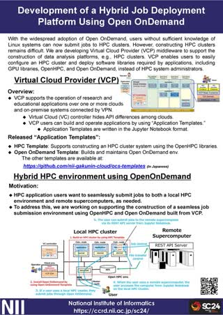
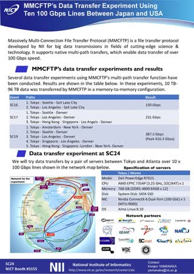

# Academic Information Infrastructure for Data-Driven Science

The National Institute of Informatics (NII) seeks to advance integrated research and development activities in informationrelated fields, including networking, software, and content. NII also promotes the creation of state-of-the-art academic information infrastructure, designed by fusing the ultra high-speed network, SINET6, and the research data platform, NII Research Data Cloud, to promote data-driven science.

[](figs/1_SC24_Overview_r1.jpg)
<!---   -->
<!---  <a href="figs/1_SC24_Overview_r1.jpg"></a> -->

[[Download pdf]](docs/1_Overview_A4.pdf)

# Development of a Hybrid Job Deployment Platform Using Open OnDemand

With the widespread adoption of Open OnDemand, users without sufficient knowledge of Linux systems can now submit jobs to HPC clusters. However, constructing HPC clusters remains difficult. We are developing Virtual Cloud Provider (VCP) middleware to support the construction of data analysis platforms, e.g., HPC clusters. VCP enables users to easily configure an HPC cluster and deploy software libraries required by applications, including GPU libraries, OpenHPC, and Open OnDemand, instead of HPC system administrators.

[](figs/2_SC24_VCP-r7.jpg)
<!---  -->
<!--- <a href="figs/2_SC24_VCP-r7.jpg"></a> -->

[[Download pdf]](docs/2_VCP_A4.pdf)

# IoT Stream Processing

The “big data” generated by numerous indoor and outdoor IoT devices must be securely analyzed in real time to create various innovative services. SINET allows the construction of an end-to-end isolated HPC and IoT environment using VPN over mobile and wired networks. SINETStream is a software library that enables the easy development of secure and efficient IoT applications over the environment.

[](figs/3_SC24_nii_poster_SINETStream.jpg)

[[SINETStream]](https://www.sinetstream.net/index.en.html) [[Download pdf]](docs/3_SC24_nii_poster_SINETStream-A4.pdf)

# Zero Trust based IoT Security

This project aims to realize secure Internet of Things (IoT) systems by the concept of zero trust by the fusion of formal verification and system software technologies. In formal verification research, we provide mathematical proofs for the legitimacy of IoT trust chains and address undiscovered threats by combining static and dynamic verification. In system software research, we develop mechanisms for isolated execution, automatic detection and automatic countermeasures in conjunction with the theoretical results to demonstrate zero trust IoT (ZT-IoT). 

[](figs/4_SC24_ZT-IoT_r5.jpg)

[[ZT-IoT Project]](https://zt-iot.nii.ac.jp/en/) [[Download pdf]](docs/4_SC24_ZT-IoT_A4.pdf)

# Operation Technologies for Next-Generation HPC Infrastructure

Japan is planning to develop a successor to the supercomputer “Fugaku,” Fugaku- NEXT, and is considering a next-generation computing infrastructure that would federate Fugaku-NEXT, major supercomputers in Japan, clouds, etc. In collaboration with the University of Tokyo, RIKEN R-CCS, and Institute of Science Tokyo, we investigate the operation technologies required by the computing infrastructure and introduce the topics of resource management and security.

[](figs/5_SC24.ngfs.r8.jpg)

[[Download pdf]](docs/5_SC24.ngfs.A4.pdf)

# Practice of Efficient Identity Proofing in HPCI Sign-up with Federated Credentials

HPCI is a distributed high performance computing infrastructure in Japan, composed of supercomputers and large file storages connected by the high speed network SINET. User identity proofing in HPCI identity management is still a heavy burden on not only users but also administrators. To resolve such old and new problems, we develop a self-service approach to proofing user identity with authentication federations, concretely, a sign-up with federated credentials.

[](figs/6_SC24_nii_HPCI_a4.jpg)

[[Download pdf]](docs/6_SC24_nii_HPCI_a4.pdf)

# Case Studies of Hybrid Cloud Architectures for Astronomical Observatory Data

Adopting public cloud services for scientific research will reduce the total cost of ownership, allow the use of state-of-the-art technologies (e.g., the latest GPUs), and establish BCP. However, no methodology exists for designing an optimal architecture to realize these advantages. We have been conducting case studies of storing and analyzing ALMA radio telescope data in public cloud services in collaboration with the National Astronomical Observatory of Japan (NAOJ) to demonstrate the best practices and discuss the design of a suitable architecture.

[](figs/7_SC24_Astronomy.jpg)

[[Download pdf]](docs/7_SC24_Astronomy.pdf)

# Research Data Analysis Platform for Reproducible Data-driven Science

To promote data-driven science, a high degree of integration between research data and computational resources is desired. 
NII develops the national research data platform called NII Research Data Cloud (RDC). It consists of GakuNin RDM, an OSF-based research data management service, JAIRO Cloud, an Invenio-based repository service, and CiNii Research, a discovery service.
CCRD is developing a variety of computing services that cooperate with NII RDC to facilitate the use of research data by diverse researchers.

[](figs/8_SC24_FCS-r1.jpg)

[[Download pdf]](docs/8_SC24_FCS_A4.pdf)

# Literate Computing for Reproducible Infrastructure (LC4RI)

<span style="color: blue;"><em>LC4RI</em></span> uses Jupyter Notebooks to share reproducible IT workflows, enable collaboration within DevOps teams, and provide reproducible IT environments for research projects.<br>
<span style="color: blue;"><em>Reproducibility Extensions for Jupyter Notebook:</em></span> Jupyter Notebook was designed initially as a non-linear explorative computing tool, typically for data-driven scientists. As a countermeasure to ensure robust, traceable, and reproducible IT operations, the “Semi-Linier Extension” constrains arbitrary cell executions into semi-linear orders and records throughout loggings. As for consolidating and flexible remarks, “sidestickes” enable collaborative annotation across notebooks.

<!--- <a href="docs/9_SC24_Literate_Computing-v1.2_A4.pdf"></a> -->
[](figs/9_SC24_Literate_Computing-v1.2_A4.jpg)

[[Download pdf]](docs/9_SC24_Literate_Computing-v1.2_A4.pdf)

> <span style="color: blue;"><em>Demo on MyBinder.org:</em></span>
> ```
> https://mybinder.org/v2/gh/NII-cloud-operation/Jupyter-LC_docker/sc-demo?urlpath=tree
> ```
> <span style="color: blue;"><em>Demo on your computer:</em></span>
> ```
> docker run -it --rm -p 8888:8888 niicloudoperation/notebook:sc-demo  jupyter lab --LabApp.default_url=/tree
> ```
> .. then access the URL given by this command.  Like `http://127.0.0.1:8888/tree?token=xxxxxx`

# MMCFTP's Data Transfer Experiment Using Ten 100 Gbps Lines Between Japan and USA (demonstrated at NICT booth #3155)

Today, academic networks are interconnected through international lines of over 100 Gbps. By combining and using these lines simultaneously, we can achieve the faster data transfers needed for cutting-edge scientific and technological research. In this demonstration, Japan and the US will be connected via 10 x 100 Gbps lines, and memory-to-memory transfer experiments will be conducted using MMCFTP, a high-speed transfer tool that supports multipath transfers. We aim to achieve a peak speed of 800 Gbps.

[](figs/10_sc24_mmcftp.jpg)

[[Download pdf]](docs/10_sc24-mmcftp.pdf)

