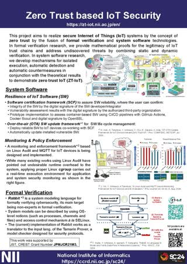

# Academic Information Infrastructure for Data-Driven Science

The National Institute of Informatics (NII) seeks to advance integrated research and development activities in informationrelated fields, including networking, software, and content. NII also promotes the creation of state-of-the-art academic information infrastructure, designed by fusing the ultra high-speed network, SINET6, and the research data platform, NII Research Data Cloud, to promote data-driven science.

[[Download pdf]](docs/1_Overview_A4.pdf)

# Development of a Hybrid Job Deployment Platform Using Open OnDemand

With the widespread adoption of Open OnDemand, users without sufficient knowledge of Linux systems can now submit jobs to HPC clusters. However, constructing HPC clusters remains difficult. We are developing Virtual Cloud Provider (VCP) middleware to support the construction of data analysis platforms, e.g., HPC clusters. VCP enables users to easily configure an HPC cluster and deploy software libraries required by applications, including GPU libraries, OpenHPC, and Open OnDemand, instead of HPC system administrators.

[[Download pdf]](docs/2_VCP_A4.pdf)

# IoT Stream Processing

The “big data” generated by numerous indoor and outdoor IoT devices must be securely analyzed in real time to create various innovative services. SINET allows the construction of an end-to-end isolated HPC and IoT environment using VPN over mobile and wired networks. SINETStream is a software library that enables the easy development of secure and efficient IoT applications over the environment.

[[SINETStream]](https://www.sinetstream.net/index.en.html) [[Download pdf]](docs/3_SC24_nii_poster_SINETStream-A4.pdf)

# Zero Trust based IoT Security

This project aims to realize secure Internet of Things (IoT) systems by the concept of zero trust by the fusion of formal verification and system software technologies. In formal verification research, we provide mathematical proofs for the legitimacy of IoT trust chains and address undiscovered threats by combining static and dynamic verification. In system software research, we develop mechanisms for isolated execution, automatic detection and automatic countermeasures in conjunction with the theoretical results to demonstrate zero trust IoT (ZT-IoT). 

[[ZT-IoT Project]](https://zt-iot.nii.ac.jp/en/) [[Download pdf]](docs/4_SC24_ZT-IoT_A4.pdf)

# Operation Technologies for Next-Generation HPC Infrastructure

Japan is planning to develop a successor to the supercomputer “Fugaku,” Fugaku- NEXT, and is considering a next-generation computing infrastructure that would federate Fugaku-NEXT, major supercomputers in Japan, clouds, etc. In collaboration with the University of Tokyo, RIKEN R-CCS, and Institute of Science Tokyo, we investigate the operation technologies required by the computing infrastructure and introduce the topics of resource management and security.

[[Download pdf]](docs/5_SC24.ngfs.A4.pdf)

# Practice of Efficient Identity Proofing in HPCI Sign-up with Federated Credentials

T.B.D.

# Case Studies of Hybrid Cloud Architectures for Astronomical Observatory Data

T.B.D.

# Research Data Analysis Platform for Reproducible Data-driven Science

T.B.D.

# Literate Computing for Reproducible Infrastructure

T.B.D.

# MMCFTP's Data Transfer Experiment Using Ten 100 Gbps Lines Between Japan and USA (demonstrated at NICT booth #3155)

Today, academic networks are interconnected through international lines of over 100 Gbps. By combining and using these lines simultaneously, we can achieve the faster data transfers needed for cutting-edge scientific and technological research. In this demonstration, Japan and the US will be connected via 10 x 100 Gbps lines, and memory-to-memory transfer experiments will be conducted using MMCFTP, a high-speed transfer tool that supports multipath transfers. We aim to achieve a peak speed of 800 Gbps.

[[Download pdf]](docs/10_sc24_mmcftp_org.pdf)

